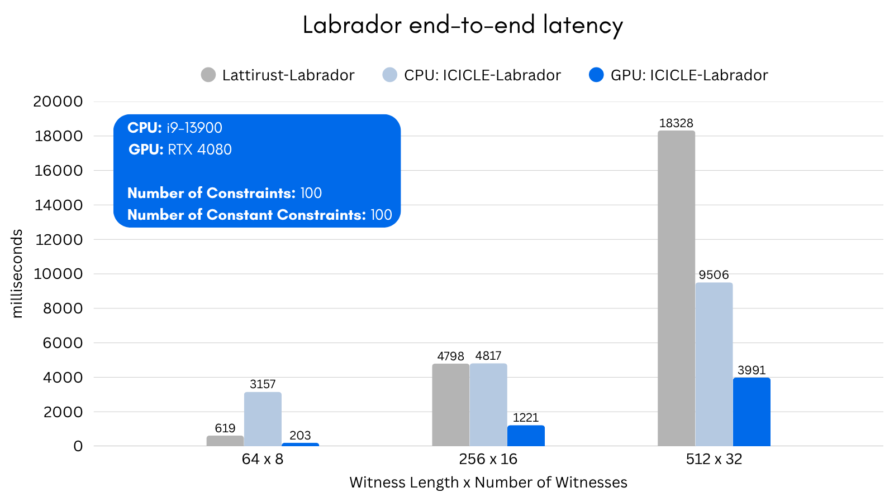

# icicle-labrador

> **⚠️ WARNING**: This code has not been audited. Use at your own risk.

This repository contains an end-to-end research demo of **LaBRADOR** — the first practical _lattice-based_ zk-SNARK (CRYPTO 2023) — built on top of **ICICLE v4**. The paper's optimized construction targets proofs around 50 kB without a trusted setup under the Module-SIS assumption. The local recursive runner below does not yet implement the optimized final round or a concrete Module-SIS estimator, so its native proof-size output is substantially larger and is not a production security claim.

ICICLE ships highly-tuned GPU and CPU kernels for FFT/NTT, polynomial arithmetic and lattice primitives. Thanks to those kernels the prover can run unchanged on a laptop CPU _or_ a CUDA-capable GPU and enjoy order-of-magnitude speed-ups.

For additional background see the original [paper](https://link.springer.com/chapter/10.1007/978-3-031-38554-4_17) and our detailed [blog post](https://hackmd.io/@Ingonyama/fast-labrador-prover).

To run the program on CPU use

```
./run.sh
```

To run on GPU, run

```
./run.sh -d CUDA
```

This script will automatically download the ICICLE CUDA backend (v4.0.0) when running with the CUDA option, build the necessary components, and run the prover.

You can also specify a custom backend installation directory with:

```
./run.sh -d CUDA -b /path/to/backend
```

## Recursive relation runner (research profile)

`scripts/labrador.py` derives the standard recursive schedule from Sections 5.3--5.5, prepares a `.lab` relation, and runs the C++ prover and verifier. A small two-execution CPU smoke test is:

```bash
python3 scripts/lab.py generate \
  --output /tmp/labrador-input.lab \
  --r 1 --n 1 --witness-bound 10 \
  --seed recursive-smoke --force

python3 scripts/labrador.py self-test

python3 scripts/labrador.py plan /tmp/labrador-input.lab \
  --executions 2 --output /tmp/labrador-plan.json --force

python3 scripts/labrador.py run /tmp/labrador-input.lab \
  --executions 2 --device CPU --build
```

Here `2` means one recursive fold followed by the final execution. The runner reports `B` in **bytes** and `KiB` in 1024-byte units. It proves and verifies in memory; it does not currently serialize a proof file. A `.lab` or `--prepared-output` file contains the secret witness in plaintext, and a `--plan-output` file is only an audit schedule—neither is a proof and neither should be shared as one.

The standalone `plan` digest covers the source statement. A plan written by `prepare`/`run` additionally covers the prepared statement digest, so those two audit hashes are intentionally different.

The recursive path enforces fixed `t1/t2` decomposition lengths, the paper's `beta'` recurrence, combined `v=t||g||h` packing, and the consolidated target-witness norm. It remains a research profile because the BabyKoala ring/challenge assumptions and field-sampling distribution are not certified here, ranks are heuristic rather than estimator-derived, and the optimized final protocol from Section 5.6 is absent.

### C11 relation frontend

For callers that cannot use Python, [scripts/lab.c](scripts/lab.c) generates the same canonical `LNPLAB01` synthetic relation and sets its initial recursive bases directly:

```bash
cmake -S src -B build/src -DCMAKE_BUILD_TYPE=Release
cmake --build build/src --target lab_c lab_runner -j

./build/src/lab_c self-test

# Without --output, this writes ./input.lab.
./build/src/lab_c generate \
  --r 1 --n 1 --witness-bound 10 \
  --seed recursive-smoke --recursions 2 --force

./build/src/lab_c inspect input.lab
LD_LIBRARY_PATH=build/icicle ./build/src/lab_runner CPU input.lab
```

`lab_c` is a C11 codec/generator; the cryptographic prover and verifier remain the C++ `lab_runner`. Its default parameter fingerprint is tied to the current `para.py`; after changing that file, pass the new 64-character value with `--fingerprint`. The C-generated `.lab` also contains the plaintext secret witness and is not a proof file.

---

The main program runs a simple benchmarking program for which the parameters can be set here:

```cpp
  std::vector<std::tuple<size_t, size_t>> arr_nr{{1 << 6, 1 << 3}};
  std::vector<std::tuple<size_t, size_t>> num_constraint{{10, 10}};
  size_t NUM_REP = 1;
  bool SKIP_VERIF = false;
  benchmark_program(arr_nr, num_constraint, NUM_REP, SKIP_VERIF);
```

The legacy `prover_verifier_trace` helper remains available in the source but is not invoked by the default benchmark. Use the recursive relation runner above for the exercised recursion path.

The following flag in [prover.h](./src/prover.h) can be used to control the program output:

```cpp
// SHOW_STEPS creates a print output listing every step performed by the Prover and the time taken
constexpr bool SHOW_STEPS = true;
```

All functions and objects are documented in code.

## Performance


